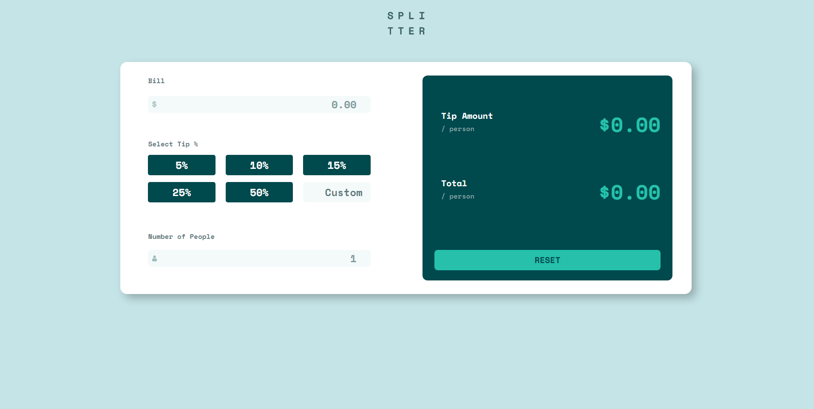
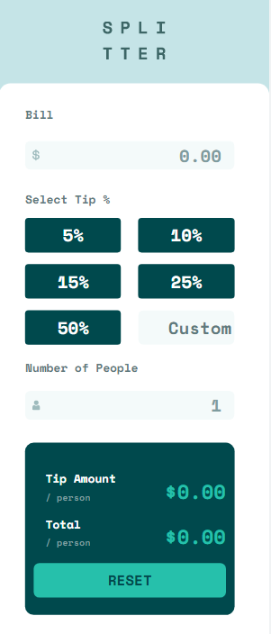

# Frontend Mentor - Interactive Card solution

This is a solution to the [Interactive card details form challenge on Frontend Mentor](https://www.frontendmentor.io/challenges/interactive-card-details-form-XpS8cKZDWw/).

## Table of contents

- [Overview](#overview)
  - [Screenshots](#screenshots)
  - [Links](#links)
- [My process](#my-process)
  - [Built with](#built-with)
  - [Useful resources](#useful-resources)
- [Author](#author)

## Overview

### Screenshots

### Links

- Solution URL: [GitHub Repo](https://github.com/tdtatum2/Tip-Calculator)
- Live Site URL: [GitHub Pages](https://tdtatum2.github.io/Tip-Calculator)

## My process

### Built with

- Semantic HTML5 markup
- CSS custom properties
- Flexbox
- Mobile-first workflow
- [React](https://reactjs.org/) - JS library
- [ReactBootstrap](https://react-bootstrap.github.io/) - Styling library built for React

### Useful resources

- [My Custom CSS Reset](https://www.joshwcomeau.com/css/custom-css-reset/) - A useful CSS Reset template by Josh W Comeau recommended to me by Kamlesh Rajesh Yadav in a comment on my first ever Frontend Mentor post!

## Author

- Website - [Fin](https://www.fintatum.com)
- Frontend Mentor - [@tdtatum2](https://www.frontendmentor.io/profile/tdtatum2)